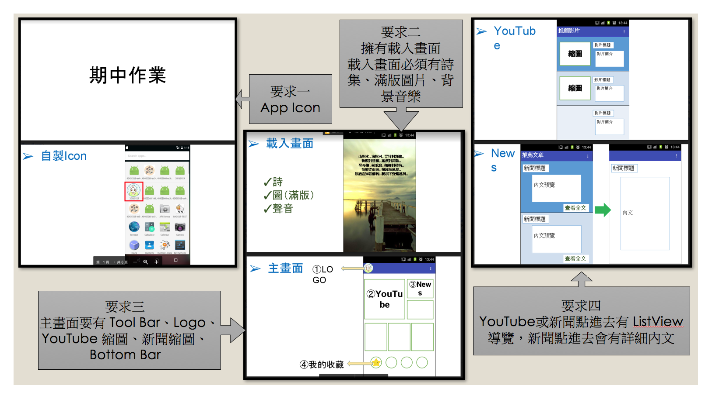

# 期中考作業，有點懶得寫說明，所以期中考那天再回來寫 README.md

# 題目要求


# 成品畫面


# 移除 ActionBar
為了客製化 ToolBar，讓我們可以自定義 ToolBar 的樣式及功能，所以我們必須定義全部 Layout 不要 ActionBar，因此要優改 res/values/styles.xml：

```xml
<resources>
    <!-- Base application theme. -->
    <!-- 設定應用程式不要顯示出 Toolbar -->
    <style name="AppTheme" parent="Theme.AppCompat.Light.NoActionBar">
        <!-- Customize your theme here. -->
        <item name="colorPrimary">@color/colorPrimary</item>
        <item name="colorPrimaryDark">@color/colorPrimaryDark</item>
        <item name="colorAccent">@color/colorAccent</item>
    </style>
</resources>
```

# 引入參考
以及因為個人習慣性的引入一些好用的參考，請在 build.gradle (Module:app) 當中加入：

```
dependencies {

    // Code ...

    // Bootstrap
    // https://github.com/Bearded-Hen/Android-Bootstrap
    compile 'com.beardedhen:androidbootstrap:2.3.0'

    // HTextView 動畫
    // https://github.com/hanks-zyh/HTextView
    compile 'hanks.xyz:htextview-library:0.1.5'

    // Navigation Bar UI
    // https://github.com/roughike/BottomBar
    compile 'com.roughike:bottom-bar:2.0.2'
}
```

# 製作載入畫面
請多拉一個 Empty Activity，並在 AndroidManifest.xml 指定它為起始畫面，然後就開始排版，比較需要注意的是 ImageView 滿版的方法及引用 HTextView 的使用方法：

```xml
<ImageView
    ...
    指定顯示方式為滿版
    android:scaleType="centerCrop" />

<com.hanks.htextview.HTextView
    ...
    指定顯示動畫的方式
    htext:animateType="typer" />
```

再來新增點擊事件，如果畫面被點擊了，就刷新顯示的內容，如果內容已經顯示完了，那就跳轉到主頁面去。

```Java
public void splashScreenClick(View view) {
    mCounter++;
    if (mCounter < sentences.length) {
        hTextView.animateText(sentences[mCounter]);
    } else {
        Intent intent = new Intent();
        intent.setClass(this, MainActivity.class);
        startActivity(intent);
        finish();
        overridePendingTransition(android.R.anim.fade_in, android.R.anim.fade_out);

        this.mediaPlayer.stop();
    }
}
```

不過顯示的內容可以從 res/values/strings.xml 當中讀取，無論是字串還是陣列，我們首先要到 xml 去定義資料：

```xml
<!-- 定義字串 -->
<string name="string-name">...</string>

<!-- 定義陣列 -->
<string-array name="string-array-name">
    <item>...</item>
</string-array>
```

然後在 Java 當中直接利用 getResources() 的方法，即可取得 strings.xml 當中的值了：

```Java
// 取得字串
getResources().getString(R.string.string-name);
// 取得陣列
getResources().getStringArray(R.array.string-array-name);
```

# 主要畫面

根據題型的指示，有非常多種做法，像是用 GrilLayout 來達成目的，但我比較偏向於較複雜的做法，因為可客製化的內容也較寬廣，利用 LinearLayout 的方式來切版，再利用 RelativeLayout 來做方格內較為特殊的排版方式，整理完後的 xml 大概如下：

```xml
<?xml version="1.0" encoding="utf-8"?>
<LinearLayout ... >

    <android.support.v7.widget.Toolbar> ... </android.support.v7.widget.Toolbar>

    <LinearLayout ...>

        <LinearLayout ... >

            <RelativeLayout ... >
                <ImageView ... />
                <TextView ... />
            </RelativeLayout>

            <LinearLayout ... >

                <RelativeLayout ... >
                    <ImageView ... />
                    <TextView ... />
                </RelativeLayout>

                <RelativeLayout ... >
                    <ImageView ... />
                    <TextView ... />
                </RelativeLayout>
                
            </LinearLayout>
        </LinearLayout>

        <LinearLayout ...>

            <RelativeLayout>
                <ImageView ... />
                <TextView ... />
            </RelativeLayout>

            <RelativeLayout>
                <ImageView ... />
                <TextView ... />
            </RelativeLayout>

            <RelativeLayout>
                <ImageView ... />
                <TextView ... />
            </RelativeLayout>

        </LinearLayout>

        <com.roughike.bottombar.BottomBar ... />

    </LinearLayout>
</LinearLayout>
```

接著我們要考慮到，如果點到方格，我們就要啟動 VideoActivity 或者 NewsActivity，所以設定對應的 onClick 事件：

```Java
// 如果是 Video 的 onClick 事件
public void videoClick(View view) {
    Intent intent = new Intent(this, VideoListActivity.class);
    startActivity(intent);
}

// 如果是 News 的 onClick 事件
public void newsClick(View view) {
    Intent intent = new Intent(this, NewsListActivity.class);
    startActivity(intent);
}
```

再來要想到 Bottom Bar 的點擊事件，因為是引入外部參考，所以必須在 onCreate 當中加入處理：

```Java
bottomBar = (BottomBar) findViewById(R.id.bottomBar);
bottomBar.setOnTabSelectListener(new OnTabSelectListener() {
    @Override
    public void onTabSelected(@IdRes int tabId) {
        String message = "";
        switch (tabId) {
            case R.id.tab_1:
                message = "我的收藏(紅色)";
                break;
            case R.id.tab_2:
                message = "我的收藏(黃色)";
                break;
            case R.id.tab_3:
                message = "我的收藏(綠色)";
                break;
            case R.id.tab_4:
                message = "我的收藏(藍色)";
                break;
        }
        Toast.makeText(MainActivity.this, message, Toast.LENGTH_SHORT).show();
    }
});

BootstrapButton toolbar_button = (BootstrapButton) findViewById(R.id.toolbar_button);
toolbar_button.setOnClickListener(new View.OnClickListener() {
    @Override
    public void onClick(View v) {
        Uri uri = Uri.parse("http://google.com");
        Intent intent = new Intent(Intent.ACTION_VIEW, uri);
        startActivity(intent);
    }
});
```

# Video Activity

當我們的主要畫面被點到 Video 事件時，移動到 Video 的清單畫面，並以 ListView 的方式來顯示出來，並希望 Toolbar 能夠多一個 Callback 的 Button，按下去後能夠回到上一頁，所以在 VideoActivity.java 當中要處理 List、Adapter、Post、Toolbar 的事件，首先我們先定義 Adapter：

```Java
// 自建一個 PostAdapter(轉接器)，並繼承 BaseAdapter
class VideoPostAdapter extends BaseAdapter {

    protected int cellLayout;
    protected LayoutInflater layoutInflater;
    protected List<VideoPost> postList = new ArrayList<>();

    public VideoPostAdapter(Context context) {
        if (context.getClass().equals(VideoListActivity.class))
            this.cellLayout = R.layout.video_list_layout;

        this.layoutInflater = LayoutInflater.from(context);
        // 利用 for 迴圈去建造 50 筆資料
        for (int i = 0; i < 10; i++)
            postList.add(new VideoPost(R.drawable.rurumi, context.getResources().getString(R.string.main_news_top_left)));
    }

    // (1)複寫長度方法
    @Override
    public int getCount() {
        // 回傳 Post(Cell) 的長度
        return postList.size();
    }

    // (2)複寫取得 Post(Cell) 的方法
    @Override
    public Object getItem(int position) {
        // 回傳目標 Post(Cell)，例如被點到10號 Post(Cell)，就會回傳 postList.get(10))
        // 像 onItemClick 事件的 (... int position ...)
        return postList.get(position);
    }

    // (3)複寫取得 Post(Cell) 編號的方法
    @Override
    public long getItemId(int position) {
        // 回傳目標 Post(Cell) 的編號，例如被點到 10 號 Post(Cell)，就會回傳 10 號
        // 像 onItemClick 事件的 (... long id)
        return position;
    }

    // (4)複寫取得目標 Post(Cell) 畫面(Item View) 的方法
    @Override
    public View getView(int position, View convertView, ViewGroup parent) {
        // 如果 convertView 是空的
        if (convertView == null)
            // 就給它一個 View，這個 View 是自訂的 activity_list_view_cell
            convertView = layoutInflater.inflate(this.cellLayout, parent, false);

        // 取得目標 Post 的資料
        VideoPost videoPost = postList.get(position);

        // 抓取 convertView 的 ImageView，並指定它顯示的圖片
        ((ImageView) convertView.findViewById(R.id.activity_video_list_imageView)).setImageResource(videoPost.getImage());

        // 抓取 convertView 的 TextView(Title)，並指定它顯示的內容
        ((TextView) convertView.findViewById(R.id.activity_video_list_titleText)).setText(String.valueOf(videoPost.getTitle()));

        // 將整個 convertView 回傳
        return convertView;
    }
}
```

接著我們要定義 Post 種子格式：

```Java
// 存放資料的種子
class VideoPost {

    // 定義 ImageView 的 R.id
    protected int imageId;
    // 定義 TextView(title) 的值
    protected String title;

    public VideoPost(int imageId, String title) {
        this.setImage(imageId);
        this.setTitle(title);
    }

    public int getImage() {
        return this.imageId;
    }

    public String getTitle() {
        return this.title;
    }

    private void setImage(int imageId) {
        this.imageId = imageId;
    }

    private void setTitle(String title) {
        this.title = title;
    }
}
```

接著我們要想到，如果返回上一頁或者 Activity 停止活動後的處理事件，這牽涉到生命週期，所以我們必須複寫一些方法：


```Java
@Override
public boolean onKeyDown(int keyCode, KeyEvent event) {
    // TODO Auto-generated method stub
    this.callBack();
    return true;
}

@Override
public void onStop() {
    super.onStop();
    this.finish();
}
```

再來處理 callBack 的 function，用來執行返回上一頁(主頁面)的事件：

```Java
private void callBack() {
    Intent intent = new Intent();
    intent.setClass(this, MainActivity.class);
    startActivity(intent);
    overridePendingTransition(android.R.anim.slide_in_left, android.R.anim.slide_out_right);
}
```

最後我們要在 onCreate 當中加入 ListView 的處理事件：

```
// 指定在頁面當中的 ListView 元件
ListView listView = (ListView) findViewById(R.id.activity_video_listView);
// 賦予 ListView 一個 Adapter 元件
listView.setAdapter(new VideoPostAdapter(this));
// 賦予 OnItemClick 選項被點擊的事件
listView.setOnItemClickListener(new AdapterView.OnItemClickListener() {
    @Override
    public void onItemClick(AdapterView<?> parent, View view, int position, long id) {
        // 取得被點擊的 Item(Cell)
        VideoPost post = (VideoPost) parent.getItemAtPosition(position);
        // 取得 Item(Cell) 當中的 Arg 與 Name
        String text = "Title : " + post.getTitle();
        // 以 Toast(吐司訊息) show 出內容
        Toast.makeText(VideoListActivity.this, text, Toast.LENGTH_SHORT).show();
    }
});
```

處理完後，我們似乎還少了一個東西，那就是在 Toolbar 當中的 callback 事件，我們只要加入：

```Java
ImageView imageView = (ImageView) findViewById(R.id.activity_video_list_toolbar_callback);
imageView.setOnClickListener(new View.OnClickListener() {
    @Override
    public void onClick(View v) {
        callBack();
    }
});
```

# NewsActivity

News 的處理方法跟 Video 差不多，就不重複說明了，比較需要注意的是 ListView 的選項被點了之後，我們要移動到詳細新聞的地方，並秀出該詳細新聞，所以我們必須在 setOnItemClickListener 當中做處理：

```Java
// 賦予 OnItemClick 選項被點擊的事件
listView.setOnItemClickListener(new AdapterView.OnItemClickListener() {
    @Override
    public void onItemClick(AdapterView<?> parent, View view, int position, long id) {
        Intent intent = new Intent(NewsListActivity.this, NewsFullActivity.class);
        startActivity(intent);
    }
});
```